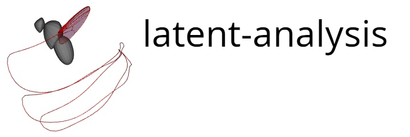
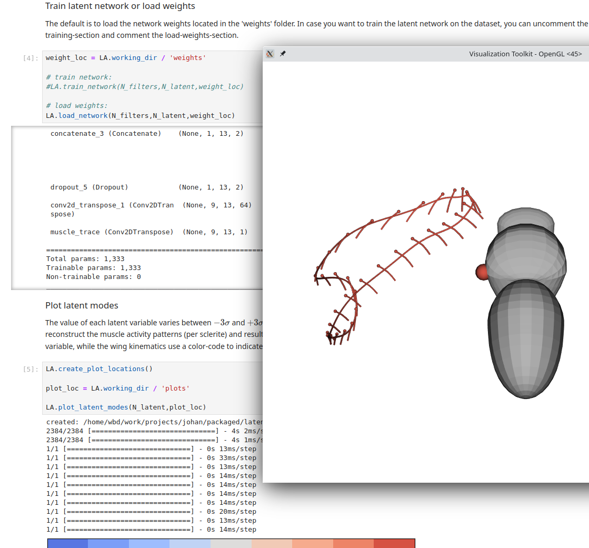

Software and Jupyter notebook for performing the latent variable analysis from
Melis, Siwanowicz, and Dickinson 2024.

### System Requirements

Tested on ubuntu 22.04 with Python 3.11.4

### Dependencies
The complete list of software dependencies can be found in the "dependencies"
section of the pyproject.toml file. All of the dependencies will be
automatically installed by the Package Installer for Python (pip) when the
software is installed.

### Installation
Requires a working installation of Python. To install cd into the source
Download source and cd into source directory. Then to install using pip run 

```bash
pip install .
```

or to install using [poetry](https://python-poetry.org/) run

```bash
poetry install
```

Software dependencies should be automatically downloaded during the
installation. 

## Dataset and Jupyter notebook 

Download the required dataset, main_muscle_and_wing_data.h5, from CaltechDATA
[here](https://data.caltech.edu/records/aypcy-ck464) and place the file in
'notebook/dataset'.  

Run the notebook
```bash
jupyter notebook Latent_Variable_Analysis.ipynb
```

Typical install time is 5-10min.

---




